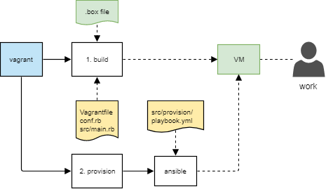

# Vagrant Virtualbox Linux VM

Creates and provisions a minimal Linux VM into Virtualbox using Vagrant.

## Description

The provisioned VM will be based on the the Virtualbox `.box` file created by [packer-linux-vagrant-virtualbox](https://github.com/lqueryvg/packer-linux-vagrant-virtualbox)
(see [here](https://github.com/lqueryvg/packer-linux-vagrant-box#description) for a list of the `.box` features.)

The VM will have the following features:

- configurable:
  - user account name and UID
  - locale and keyboard type
  - timezone
- ssh authorized keys for the configured user (assuming you provide the public key)
- bash with vi mode as default
- sudo root access with `NOPASSWD` for the user
- various fundamental packages, e.g. `docker` & `git`
- user configured to be in docker group (no need to be root to use docker)
- docker starts without selinux
- The host machine user's home directory mapped via Virtualbox share (vboxsf) to `/host_home`

## Pre-requisites

- a `.box` file created using [packer-linux-vagrant-box](https://github.com/lqueryvg/packer-linux-vagrant-virtualbox)
- [Vagrant](http://vagrantup.com/)
- [VirtualBox](https://www.virtualbox.org/) (if you want to build the VirtualBox box)
- an ssh public key in `~/.ssh/id_rsa.pub` (configurable)
  - to generate a key pair on Windows, see [here](https://www.ssh.com/ssh/putty/windows/puttygen)

## Usage

    vi conf.rb         # check / change settings
    vagrant up

## Directory Structure

    .
    ├── conf.rb        # <<<── user configuration
    ├── README.md
    ├── Vagrantfile    # do not edit
    └── src/           # source scripts

## Diagram

    Diagram source: https://drive.google.com/file/d/1zXgdcXXVHnVE8owNVnxPjz1wLNy7Ugir/view?usp=sharing

## Notes

- If the Ansible provisioning fails, run `vagrant provision` to avoid having to re-create the whole VM.

## TODO

- separate ansible role for the docker bits
